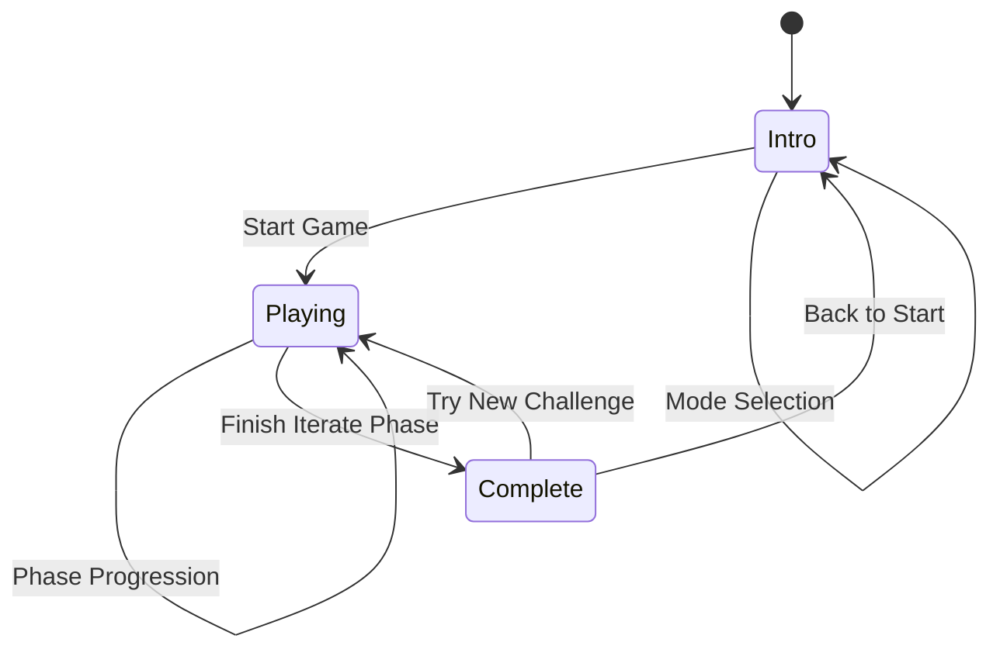

# Design Document

## Overview

The IDEO Design Sprint Game is a single-page React application that provides an interactive, gamified learning experience for design thinking methodology. The application uses a state machine pattern to manage game flow through five distinct phases, with support for both solo and team collaboration modes.

The design prioritizes simplicity, offline capability, and ease of distribution. The entire application is self-contained in a single HTML file with inline React code, making it trivially shareable and requiring no build process or server infrastructure.

### Design Goals

1. **Zero Installation**: Users should be able to open the HTML file and start immediately
2. **Offline First**: After initial CDN loads, the game should work without internet
3. **Educational**: Guide users through authentic design thinking methodology
4. **Engaging**: Use gamification (points, progress, visual feedback) to maintain motivation
5. **Shareable**: Enable easy export and sharing of results
6. **Flexible**: Support both individual learning and team facilitation

## Architecture

### Technology Stack

- **React 18**: UI framework (loaded via CDN)
- **Tailwind CSS**: Utility-first styling (loaded via CDN)
- **Babel Standalone**: JSX transformation in browser
- **Lucide React**: Icon library (inline SVG components)
- **Vanilla JavaScript**: State management and game logic

### Application Structure

```
┌─────────────────────────────────────────┐
│         Single HTML File                │
│                                         │
│  ┌───────────────────────────────┐    │
│  │   External Dependencies       │    │
│  │   - React (CDN)               │    │
│  │   - ReactDOM (CDN)            │    │
│  │   - Babel (CDN)               │    │
│  │   - Tailwind (CDN)            │    │
│  └───────────────────────────────┘    │
│                                         │
│  ┌───────────────────────────────┐    │
│  │   Inline Components           │    │
│  │   - Icons (SVG)               │    │
│  │   - IDEOGame (Main Component) │    │
│  └───────────────────────────────┘    │
│                                         │
│  ┌───────────────────────────────┐    │
│  │   State Management            │    │
│  │   - React useState hooks      │    │
│  │   - Local component state     │    │
│  └───────────────────────────────┘    │
└─────────────────────────────────────────┘
```

### State Machine Design

The application follows a finite state machine pattern with three primary states:



## Components and Interfaces

### Main Component: IDEOGame

The `IDEOGame` component is the root component that manages all application state and renders different screens based on the current game state.

#### State Variables

```typescript
// Game Flow State
gameState: 'intro' | 'playing' | 'complete'
gameMode: 'solo' | 'team' | null
currentPhase: 0 | 1 | 2 | 3 | 4  // Index into phases array

// Challenge State
challenge: Challenge | null
customChallenges: Challenge[]
enabledChallenges: Set<string>  // Set of enabled challenge titles

// User Input State
userInput: string
ideas: string[]
selectedIdeas: string[]
prototype: string | null
prototypeImages: File[]  // Uploaded images for prototype
hmwStatement: string
iterationNotes: string

// Team State
teamName: string
playerName: string
teamMembers: string[]

// Game Mechanics State
score: number
timer: number
timerActive: boolean
timerDuration: number  // Customizable timer duration in seconds

// UI State
showSettings: boolean
showShare: boolean
showAddChallenge: boolean
showEmailModal: boolean
showImportPreview: boolean
newChallenge: Challenge
importPreviewData: Challenge[]  // Challenges to preview before import
emailForm: {
  recipients: string
  subject: string
  message: string
}
```

#### Key Methods

**Game Control Methods:**
- `startGame(mode)`: Initialize new game with selected mode
- `handleSubmit()`: Process user input based on current phase
- `nextPhase()`: Advance to next phase with validation
- `toggleIdeaSelection(idea)`: Handle idea selection in Select phase

**Timer Methods:**
- `startTimer()`: Begin countdown for Ideate phase
- Timer effect: Automatic progression when time expires

**Team Management Methods:**
- `addTeamMember()`: Add player to team roster
- `removeTeamMember(member)`: Remove player from team

**Challenge Management Methods:**
- `addCustomChallenge()`: Add new challenge to pool
- `importChallenges(file)`: Parse and import challenges from JSON file
- `exportChallenges()`: Download custom challenges as JSON file
- `validateChallengeJSON(data)`: Validate imported JSON structure
- `toggleChallengeEnabled(title)`: Enable/disable a challenge for selection
- `getEnabledChallenges()`: Get list of currently enabled challenges
- `selectRandomChallenge()`: Select random challenge from enabled pool

**Image Management Methods:**
- `handleImageUpload(file)`: Process and store uploaded image
- `removeImage(index)`: Remove uploaded image
- `validateImageFile(file)`: Check file type and size

**Export Methods:**
- `downloadResults()`: Generate and download text file
- `downloadPDF()`: Generate and download PDF file
- `copyToClipboard()`: Copy summary to clipboard
- `generateShareableResults()`: Create results object
- `openEmailClient()`: Open email with pre-populated content

**Settings Methods:**
- `setTimerDuration(seconds)`: Update timer duration
- `setTopicFilter(topic)`: Set challenge topic filter

### Screen Components

The application renders different screens based on `gameState`:

#### 1. Intro Screen (`gameState === 'intro'`)

**Purpose**: Mode selection, team setup, and game initialization

**Layout Structure:**
```
┌─────────────────────────────────────┐
│  Header (Title + Settings Button)  │
├─────────────────────────────────────┤
│  Mode Selection Cards               │
│  ┌──────────┐  ┌──────────┐       │
│  │   Solo   │  │   Team   │       │
│  └──────────┘  └──────────┘       │
├─────────────────────────────────────┤
│  Team Setup (if team mode)          │
│  - Team Name Input                  │
│  - Member Management                │
├─────────────────────────────────────┤
│  Game Info (Duration, Points)       │
├─────────────────────────────────────┤
│  Action Buttons (Back, Start)       │
└─────────────────────────────────────┘
```

**Conditional Rendering:**
- Mode selection cards: Show when `gameMode === null`
- Team setup panel: Show when `gameMode === 'team'`
- Solo info cards: Show when `gameMode === 'solo'`
- Back button: Show when `gameMode !== null`

#### 2. Playing Screen (`gameState === 'playing'`)

**Purpose**: Guide user through five design phases

**Layout Structure:**
```
┌─────────────────────────────────────┐
│  Header                             │
│  - Challenge Info                   │
│  - Score Display                    │
│  - Team Info (if team mode)         │
├─────────────────────────────────────┤
│  Phase Progress Indicator           │
│  [●]──[○]──[○]──[○]──[○]          │
├─────────────────────────────────────┤
│  Current Phase Card                 │
│  - Phase Icon & Name                │
│  - Instructions                     │
│  - Tip                              │
│  - Phase-Specific Content           │
├─────────────────────────────────────┤
│  Input Area (phase-dependent)       │
│  - Text Input / Selection UI        │
│  - Submit/Next Buttons              │
└─────────────────────────────────────┘
```

**Phase-Specific Content:**

*Phase 0 - Empathize:*
- Text input for HMW statement
- Submit button
- Validation: Must include "how might we"

*Phase 1 - Ideate:*
- Text input for ideas
- Timer display and controls
- List of submitted ideas
- Minimum 5 ideas to proceed

*Phase 2 - Select:*
- Grid of clickable idea cards
- Visual selection state
- Exactly 3 selections required
- Next button (enabled when 3 selected)

*Phase 3 - Prototype:*
- Textarea for prototype description
- Image upload button with file picker
- Image preview thumbnails (up to 3 images)
- Remove image buttons
- Submit button
- Validation: Minimum 20 characters

*Phase 4 - Iterate:*
- Textarea for iteration notes
- Submit button
- Validation: Minimum 15 characters
- Completion triggers transition to Complete screen

#### 3. Complete Screen (`gameState === 'complete'`)

**Purpose**: Display results and provide export options

**Layout Structure:**
```
┌─────────────────────────────────────┐
│  Trophy Icon & Celebration Header  │
│  - Team Name (if applicable)        │
│  - Final Score                      │
├─────────────────────────────────────┤
│  Results Summary                    │
│  - Challenge                        │
│  - Team Members                     │
│  - HMW Statement                    │
│  - Ideas Count & List               │
│  - Top 3 Ideas                      │
│  - Prototype Description            │
│  - Iteration Notes                  │
├─────────────────────────────────────┤
│  Export Actions                     │
│  [Download] [Copy] [Share]          │
├─────────────────────────────────────┤
│  Navigation                         │
│  [Try New Challenge] [Back to Start]│
└─────────────────────────────────────┘
```

### Modal Components

#### Settings Modal

**Trigger**: Settings icon in intro screen header

**Content:**
- Custom challenges list
- Add challenge form
- Challenge management

**Form Fields:**
- Title (text input)
- Description (textarea)
- Persona (text input)
- Pain Point (text input)
- Topic (dropdown with custom option)

**Additional Features:**
- Import Challenges button (opens file picker)
- Export Challenges button (downloads JSON)
- Timer customization section with presets and custom input
- Challenge Selection section with checkboxes for each challenge
- Challenge list with topic badges and enable/disable toggles
- Warning message when no challenges are enabled

#### Share Modal

**Trigger**: Share button on complete screen

**Content:**
- Results summary preview
- Copy summary button
- Download full report button
- Download PDF button
- Email results button

#### Email Modal

**Trigger**: Email Results button on complete screen

**Content:**
- Recipient email(s) input (comma-separated)
- Subject line (pre-filled, editable)
- Optional message textarea
- Preview of email content
- Send button (opens email client)

#### Import Preview Modal

**Trigger**: After selecting JSON file for import

**Content:**
- Number of challenges to import
- List of challenge titles with topics
- Duplicate detection warnings
- Import All button
- Cancel button

## Data Models

### Challenge

```typescript
interface Challenge {
  title: string;           // Short challenge name
  description: string;     // Problem context
  persona: string;         // User persona description
  painPoint: string;       // Core user pain point
  topic: string;          // Challenge category/topic
}
```

**Default Challenges:**
1. Campus Coffee Crisis (Education)
2. Remote Team Disconnect (Business)
3. Sustainable Shopping Struggle (Sustainability)
4. Fitness Motivation Gap (Healthcare)

**Topics:**
- Predefined: Education, Business, Healthcare, Technology, Sustainability, Social Impact, Product Design, Service Design
- Custom: User-defined topics

**Storage**: Custom challenges stored in component state (session-only)

### Phase Configuration

```typescript
interface Phase {
  name: string;           // Phase name (Empathize, Ideate, etc.)
  icon: React.Component;  // Lucide icon component
  color: string;          // Tailwind background color class
  instruction: string;    // Main instruction text
  placeholder?: string;   // Input placeholder text
  tip: string;           // Helpful tip for users
}
```

**Phase Definitions:**
- Phase 0: Empathize (Users icon, blue)
- Phase 1: Ideate (Lightbulb icon, yellow)
- Phase 2: Select (Target icon, green)
- Phase 3: Prototype (Rocket icon, purple)
- Phase 4: Iterate (RefreshCw icon, pink)

### Results Export Format

**Text File Format:**
```
IDEO DESIGN SPRINT RESULTS
========================

Team: [Team Name] / Solo Sprint
Members: [Comma-separated names]
Challenge: [Challenge Title] ([Topic])
Date: [MM/DD/YYYY]
Score: [Points] points

HOW MIGHT WE STATEMENT
[HMW text]

IDEAS GENERATED ([count] total)
1. [Idea 1]
2. [Idea 2]
...

TOP 3 SELECTED IDEAS
1. [Selected Idea 1]
2. [Selected Idea 2]
3. [Selected Idea 3]

PROTOTYPE
[Prototype description]

[Note: [X] images attached - see PDF export for visuals]

ITERATION & REFLECTION
[Iteration notes]

---
Generated by IDEO Design Sprint Game
```

**PDF Format:**
- Professional header with logo/title and date
- Challenge section with topic badge
- Team information (if applicable)
- HMW statement in highlighted box
- Ideas section with numbered list
- Top 3 ideas with visual emphasis
- Prototype section with embedded images
- Iteration notes section
- Footer with score and generation timestamp

**Clipboard Format:**
```
🎨 IDEO Design Sprint Results

👥 Team: [Name] / 🧑 Solo Sprint
🎯 Challenge: [Title] ([Topic])
⭐ Score: [Points] points
💡 Ideas Generated: [Count]

Top Concept: [First selected idea]
```

**Email Format:**
```
Subject: Design Sprint Results - [Challenge Title]

Hi,

Here are the results from our IDEO Design Sprint:

Challenge: [Title] ([Topic])
Team: [Name] / Solo Sprint
Date: [Date]
Score: [Points] points

HOW MIGHT WE:
[HMW statement]

TOP 3 IDEAS:
1. [Idea 1]
2. [Idea 2]
3. [Idea 3]

PROTOTYPE:
[Description]

[Note: Images attached separately]

NEXT STEPS:
[Iteration notes]

---
Generated by IDEO Design Sprint Game
```

### Challenge Import/Export Format

**JSON Schema:**
```json
{
  "version": "1.0",
  "exportDate": "2025-10-05T12:00:00Z",
  "challenges": [
    {
      "title": "Challenge Title",
      "description": "Detailed problem description",
      "persona": "User persona details",
      "painPoint": "Main pain point or frustration",
      "topic": "Education"
    }
  ]
}
```

**Validation Rules:**
- Version must be "1.0"
- Challenges array must exist and contain at least one challenge
- Each challenge must have all required fields (title, description, persona, painPoint, topic)
- Topic must be a non-empty string
- All string fields must be non-empty after trimming

## Error Handling

### Input Validation

**Empathize Phase:**
- Error: HMW statement doesn't include "how might we"
- Handler: Alert with message "Try starting with 'How might we...'"
- Recovery: User can edit and resubmit

**Ideate Phase:**
- Error: Empty input submission
- Handler: Silent ignore (no error shown)
- Recovery: User continues entering ideas

**Select Phase:**
- Error: Attempting to select more than 3 ideas
- Handler: Silent ignore (selection doesn't register)
- Recovery: User must deselect before selecting another

**Prototype Phase:**
- Error: Description less than 20 characters
- Handler: Alert with message "Describe your prototype in more detail!"
- Recovery: User can edit and resubmit

**Iterate Phase:**
- Error: Notes less than 15 characters
- Handler: Alert with message "Share more thoughts on how to improve!"
- Recovery: User can edit and resubmit

### Team Setup Validation

**Error**: Starting team mode without team name or members
**Handler**: Alert with message "Please enter a team name and add at least one team member"
**Recovery**: User fills required fields before starting

### Custom Challenge Validation

**Error**: Submitting challenge with missing fields
**Handler**: Alert with message "Please fill in all fields for the challenge"
**Recovery**: User completes all fields before saving

### Image Upload Validation

**Error**: File size exceeds 5MB
**Handler**: Alert with message "Image file must be under 5MB. Please choose a smaller file."
**Recovery**: User selects a different image

**Error**: Invalid file type
**Handler**: Alert with message "Please upload an image file (PNG, JPG, JPEG, GIF, or SVG)"
**Recovery**: User selects a valid image file

**Error**: Attempting to upload more than 3 images
**Handler**: Alert with message "Maximum 3 images allowed. Please remove an image before adding another."
**Recovery**: User removes an existing image first

### JSON Import Validation

**Error**: Invalid JSON format
**Handler**: Alert with message "Invalid JSON file. Please check the file format and try again."
**Recovery**: User provides a valid JSON file

**Error**: Missing required fields in challenges
**Handler**: Alert with message "Some challenges are missing required fields: [list fields]. Import cancelled."
**Recovery**: User fixes JSON file and re-imports

**Error**: No challenges in file
**Handler**: Alert with message "No challenges found in the file. Please check the file content."
**Recovery**: User provides a file with challenges

### Timer Customization Validation

**Error**: Timer duration outside valid range (30-1800 seconds)
**Handler**: Alert with message "Timer duration must be between 30 seconds and 30 minutes"
**Recovery**: User enters a valid duration

**Error**: Non-numeric timer input
**Handler**: Alert with message "Please enter a valid number of seconds"
**Recovery**: User enters numeric value

### Browser Compatibility

**CDN Loading Failures:**
- Symptom: Blank white screen
- Cause: No internet on first load
- Recovery: Requires internet connection for initial CDN loads
- Prevention: Document in README

**Download Failures:**
- Symptom: Download button doesn't work
- Cause: Browser download permissions
- Recovery: Use "Copy to Clipboard" alternative
- Prevention: Provide multiple export options

## Testing Strategy

### Unit Testing Approach

**State Management Tests:**
- Test state transitions between game states
- Test phase progression logic
- Test score calculation
- Test timer countdown behavior

**Validation Tests:**
- Test HMW statement validation
- Test minimum character requirements
- Test idea selection limits
- Test team setup validation

**Data Transformation Tests:**
- Test results export formatting
- Test clipboard text generation
- Test challenge randomization

### Integration Testing Approach

**User Flow Tests:**
- Complete solo game flow from start to finish
- Complete team game flow with multiple members
- Test custom challenge creation and usage
- Test all export methods

**Phase Transition Tests:**
- Test progression through all 5 phases
- Test phase-specific validation gates
- Test score accumulation across phases

**UI Interaction Tests:**
- Test mode selection and switching
- Test team member add/remove
- Test idea submission and selection
- Test modal open/close behavior

### Manual Testing Checklist

**Solo Mode:**
- [ ] Start solo game
- [ ] Complete Empathize phase
- [ ] Generate 5+ ideas in Ideate
- [ ] Select 3 ideas in Select
- [ ] Submit prototype
- [ ] Complete iteration notes
- [ ] Download results
- [ ] Copy to clipboard

**Team Mode:**
- [ ] Enter team name
- [ ] Add multiple team members
- [ ] Remove team member
- [ ] Start team game
- [ ] Submit ideas with attribution
- [ ] Complete full game
- [ ] Verify team info in results

**Custom Challenges:**
- [ ] Open settings
- [ ] Add custom challenge
- [ ] Verify challenge appears in pool
- [ ] Start game with custom challenge

**Edge Cases:**
- [ ] Try to start without mode selection
- [ ] Try to start team mode without setup
- [ ] Submit invalid HMW statement
- [ ] Try to select 4th idea
- [ ] Submit short prototype description
- [ ] Test timer expiration
- [ ] Test browser back button behavior

### Browser Testing Matrix

**Required Browsers:**
- Safari (macOS) - Primary target
- Chrome (macOS, Windows)
- Firefox (macOS, Windows)
- Edge (Windows)

**Mobile Browsers:**
- Safari (iOS)
- Chrome (Android)

**Testing Focus:**
- CDN resource loading
- Local storage behavior
- Download functionality
- Clipboard API support
- Responsive layout
- Touch interactions (mobile)

### Performance Testing

**Metrics to Monitor:**
- Initial page load time
- CDN resource load time
- State update responsiveness
- Timer accuracy
- Large idea list rendering (50+ ideas)

**Performance Targets:**
- Page load: < 3 seconds (with CDN)
- State updates: < 100ms
- Timer drift: < 1 second over 3 minutes
- Smooth scrolling with 100+ ideas

## Accessibility Considerations

### Keyboard Navigation

- All interactive elements accessible via Tab
- Enter key submits forms
- Escape key closes modals
- Arrow keys for idea selection (optional enhancement)

### Screen Reader Support

- Semantic HTML elements (button, input, textarea)
- ARIA labels for icon-only buttons
- Descriptive alt text for visual elements
- Announcement of score changes (optional enhancement)

### Visual Accessibility

- Color contrast ratios meet WCAG AA standards
- Color not sole indicator of state (icons + text)
- Focus indicators on interactive elements
- Readable font sizes (minimum 16px body text)

### Responsive Design

- Mobile-first approach with Tailwind breakpoints
- Touch-friendly button sizes (minimum 44x44px)
- Readable text without zooming
- Horizontal scrolling avoided

## Security Considerations

### Data Privacy

- No data sent to external servers
- No analytics or tracking
- All data stored in browser memory only
- Data cleared on page refresh

### Content Security

- No user-generated content executed as code
- No external script injection points
- CDN resources from trusted sources (unpkg, CDN)

### Safe Defaults

- Input sanitization for display (React handles by default)
- No localStorage persistence (prevents data leakage)
- No cookies or session storage

## Deployment and Distribution

### Distribution Method

**Primary**: Single HTML file distribution
- Email attachment
- File sharing services (Dropbox, Google Drive)
- USB drive
- Internal file servers

**No Build Process Required:**
- No npm install
- No webpack/bundler
- No server deployment
- No environment configuration

### Version Management

**Version Tracking:**
- Version number in README
- CHANGELOG.md for release notes
- Date stamp in exported results

**Update Distribution:**
- Replace HTML file with new version
- Users download new file
- No automatic updates

### Browser Caching

**CDN Resources:**
- React, ReactDOM, Babel, Tailwind cached by browser
- Subsequent loads faster
- Works offline after first load

**HTML File:**
- No caching headers needed
- Users always have latest version they downloaded

## Implementation Details for New Features

### PDF Export Implementation

**Library**: jsPDF (loaded via CDN)
**Approach**:
1. Load jsPDF library dynamically when PDF export is triggered
2. Create PDF document with proper page layout
3. Add text content with formatting (headers, body text, lists)
4. Embed uploaded images using base64 encoding
5. Handle pagination for long content
6. Trigger download with appropriate filename

**Layout Specifications**:
- Page size: A4 (210mm x 297mm)
- Margins: 20mm all sides
- Header: 18pt bold
- Section headers: 14pt bold
- Body text: 11pt regular
- Line spacing: 1.5
- Images: Max width 170mm, maintain aspect ratio

### Email Integration Implementation

**Approach**: mailto: protocol
**Limitations**:
- Cannot attach files directly via mailto
- Cannot send email programmatically
- Opens user's default email client

**Implementation**:
1. Construct mailto URL with encoded parameters
2. Include recipients, subject, and body
3. Format body text with line breaks (%0D%0A)
4. Open mailto URL in new window
5. Provide instructions for manually attaching images

**Alternative Consideration**: 
- For future enhancement, consider backend email service (SendGrid, AWS SES)
- Would require server component and API keys

### Image Upload Implementation

**Approach**: FileReader API with base64 encoding
**Storage**: In-memory as base64 data URLs

**Implementation Steps**:
1. Use `<input type="file" accept="image/*" multiple>` for file selection
2. Validate file type using MIME type check
3. Validate file size using File.size property
4. Read file using FileReader.readAsDataURL()
5. Store base64 string in state array
6. Display preview using 
7. Include base64 images in PDF export
8. Note: Images lost on page refresh (no persistence)

**Image Processing**:
- No compression or resizing (keep original)
- Display thumbnails at 150px width
- Full size in PDF export
- Max 3 images to prevent memory issues

### Timer Customization Implementation

**Storage**: Component state (session-only)
**Default**: 180 seconds (3 minutes)

**Implementation**:
1. Add timerDuration state variable
2. Provide preset buttons (60, 180, 300, 600)
3. Provide custom input field
4. Validate range: 30-1800 seconds
5. Use timerDuration when initializing timer in Ideate phase
6. Display in MM:SS format using Math.floor(timer / 60) and timer % 60

### Challenge Topic and Selection Implementation

**Predefined Topics**:
```javascript
const TOPICS = [
  'Education',
  'Business', 
  'Healthcare',
  'Technology',
  'Sustainability',
  'Social Impact',
  'Product Design',
  'Service Design',
  'Custom'
];
```

**Implementation**:
1. Add topic field to Challenge interface
2. Add topic dropdown to challenge form
3. Show custom input when "Custom" selected
4. Display topic badges using color coding
5. Add enabledChallenges Set to track which challenges are active
6. Add Challenge Selection section in settings modal
7. Display all challenges with checkboxes
8. Filter to enabled challenges when starting game
9. Include topic in all exports

**Topic Color Coding**:
- Education: Blue
- Business: Purple
- Healthcare: Red
- Technology: Cyan
- Sustainability: Green
- Social Impact: Orange
- Product Design: Pink
- Service Design: Indigo
- Custom: Gray

**Challenge Selection UI**:
```
Challenge Selection
┌─────────────────────────────────────┐
│ Select which challenges to use:     │
│                                     │
│ ☑ Campus Coffee Crisis [Education] │
│ ☑ Remote Team Disconnect [Business]│
│ ☐ Sustainable Shopping [Sustain.]  │
│ ☑ Fitness Motivation [Healthcare]  │
│                                     │
│ [Select All] [Deselect All]        │
└─────────────────────────────────────┘
```

**Selection Logic**:
1. Initialize enabledChallenges with all challenge titles
2. On checkbox toggle, add/remove from Set
3. When starting game, filter allChallenges by enabledChallenges
4. Validate at least one challenge is enabled before allowing start
5. Persist selection in component state (session-only)

### Challenge Import/Export Implementation

**Export Implementation**:
1. Create JSON object with schema
2. Add version and exportDate metadata
3. Include all custom challenges
4. Use JSON.stringify() with formatting
5. Create Blob with type 'application/json'
6. Trigger download with filename

**Import Implementation**:
1. Use `<input type="file" accept=".json">` for file selection
2. Read file using FileReader.readAsText()
3. Parse JSON using JSON.parse() with try-catch
4. Validate schema structure
5. Validate each challenge has required fields
6. Check for duplicates by title
7. Show preview modal with import summary
8. On confirm, merge into customChallenges state
9. Display success message with count

**Duplicate Handling**:
- Compare challenge titles (case-insensitive)
- Skip duplicates during import
- Show list of skipped challenges
- Allow user to see what was imported vs skipped

## Future Enhancement Considerations

### Potential Features

1. **Persistence**: LocalStorage for saving in-progress games and custom challenges
2. **Multiplayer**: Real-time collaboration via WebRTC or WebSockets
3. **Templates**: Pre-built challenge packs for different industries
4. **Advanced Export**: CSV, Markdown, DOCX formats
5. **Theming**: Customizable color schemes and branding
6. **Localization**: Multi-language support
7. **Analytics**: Optional usage tracking (with consent)
8. **Accessibility**: Enhanced screen reader support and keyboard shortcuts
9. **Mobile App**: Native iOS/Android versions
10. **Integration**: Export to Miro, Figma, Notion, Slack
11. **Image Editing**: Crop, resize, annotate images in-app
12. **Backend Service**: Email sending, cloud storage, team collaboration

### Technical Debt Considerations

**Current Limitations:**
- Single component architecture (could be split)
- No TypeScript (type safety)
- No automated tests
- No state management library
- Inline styles mixed with Tailwind
- No component library

**Refactoring Opportunities:**
- Extract phase components
- Implement proper state machine library
- Add TypeScript definitions
- Create reusable UI components
- Separate business logic from presentation
- Add comprehensive test suite
